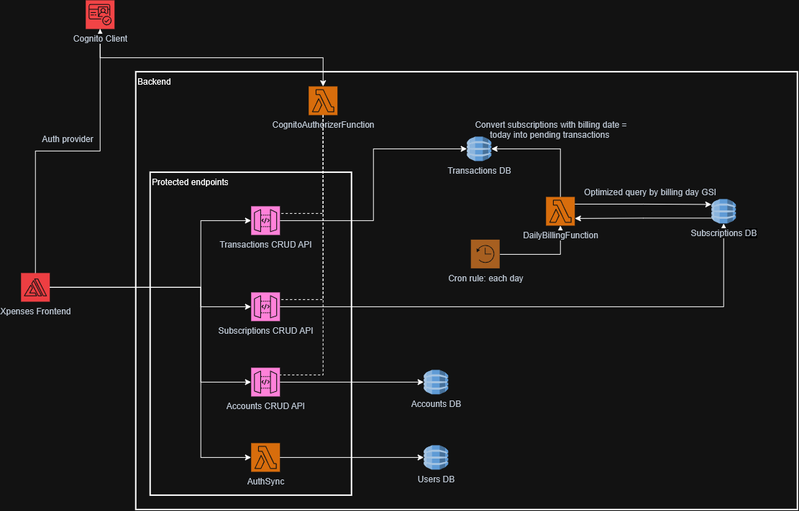

# Xpenses

Xpenses is a personal expense-management app built to make tracking day-to-day money fast and practical. Record an expense in a couple of taps, see where your money is going, and keep tabs on credit cards, savings, and recurring bills — all in one place.

It's also a hands-on learning project: a Next.js/React frontend talking to a serverless AWS backend (API Gateway + Lambda + DynamoDB), authenticated through Cognito.

## Features

### Transactions
- Record expenses and income in a few keystrokes — type a name, hit register, enter the price. Everything else (date, category) defaults sensibly and is optional.
- Tag transactions with categories, and edit or delete any past entry.
- Transfer money between two of your own accounts in a single movement.

### Accounts
- Track multiple accounts (debit, credit, cash), each with a live, backend-computed balance.
- Set an opening balance to reconcile an account with its real-world starting point.
- Mark an account as savings to keep that money out of your "spendable" balance while still counting it toward your net worth.

### Credit cards & installments
- Split a purchase into monthly installments ("cuotas"), snapshotted to the card's payment day at the time of purchase.
- See what's due now and what's coming up next, period by period.
- Pay off a card in full or partially, from any of your other accounts.

### Subscriptions
- Define recurring expenses or income (fixed or variable amount) with a monthly billing day.
- Pause, resume, or end a subscription at any time.
- Confirm a pending bill once it's actually paid, with the real amount and account.

### Dashboard
- At-a-glance balances: what you can freely spend, what's in savings, what you owe, and your true net worth.
- Filter and sort your movements by category, account, search term, date, or amount.

### Authentication
- Secure sign-in with Google, via AWS Cognito — no passwords handled by the app itself.

## Architecture

## Roadmap

- Budgets based on expected income (e.g. 40% savings, 25% entertainment).
- Spending/income analytics with time-series charts.
